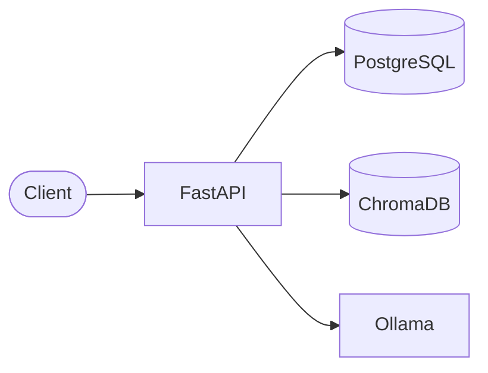
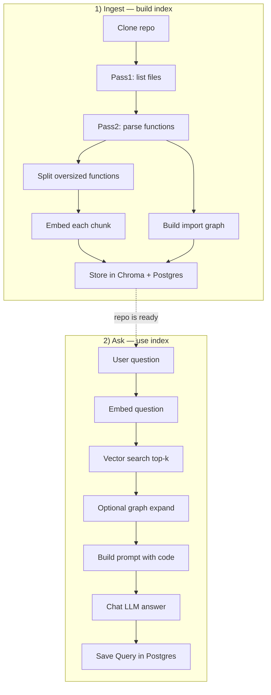
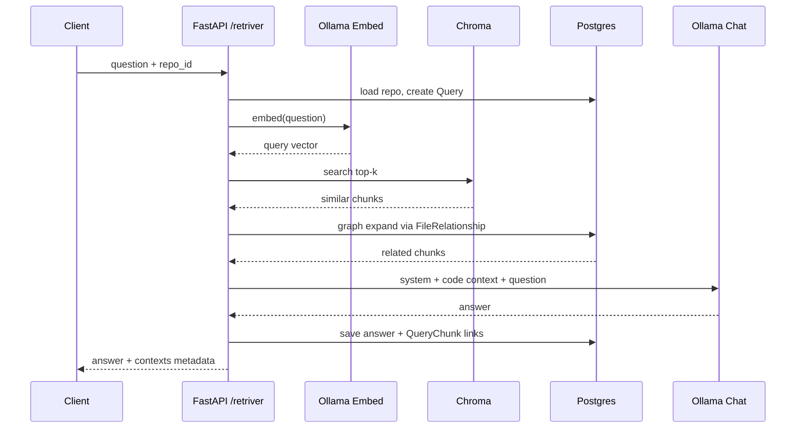
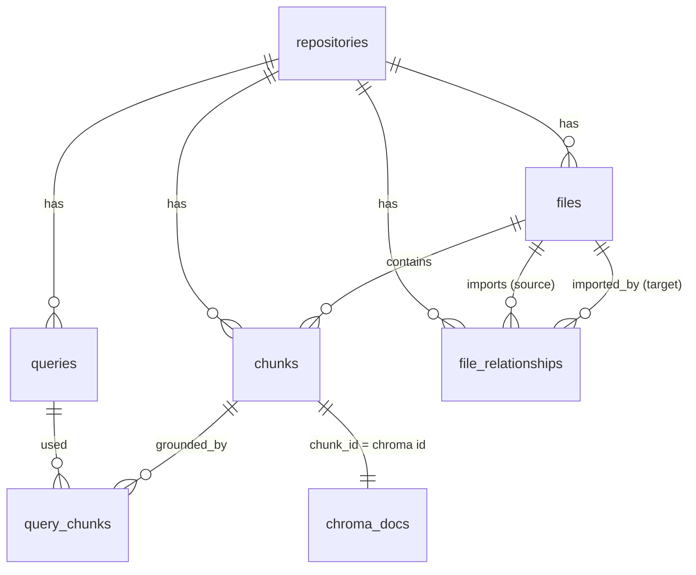
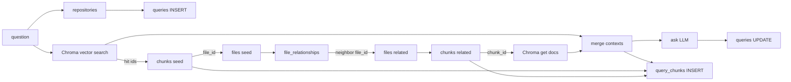

# RepoMind Backend — RAG Explained Simply

RepoMind answers questions about a **GitHub repository** using **RAG** (Retrieval-Augmented Generation).

You do **not** need deep ML knowledge to follow this. Think of it as:

> **Find the right code first → then ask the LLM using only that code.**

That “find first” step is what makes answers grounded in the real repo instead of hallucinations.

---

## 60-second RAG intuition

| Plain English | In this project |
|---|---|
| Break documents into pieces | Split code into **function chunks** |
| Turn text into numbers | **Embeddings** via Ollama |
| Store searchable numbers | **ChromaDB** (vector store) |
| Remember structure / links | **Postgres** + import **graph** |
| On a question, find similar pieces | Vector search (+ optional graph expand) |
| Give pieces + question to an LLM | **Ollama chat** (`ask`) |

```text
  Your question
       │
       ▼
  ┌─────────────┐     similar code      ┌─────────────┐
  │  Embed +    │ ───────────────────►  │   LLM       │
  │  Retrieve   │     chunks            │   Answer    │
  └─────────────┘                       └─────────────┘
         ▲
         │ pre-built during /ingest
         │
  ┌─────────────┐
  │ Repo code   │
  │ → chunks    │
  │ → vectors   │
  └─────────────┘
```

---

## System map (what talks to what)

```text
                        RepoMind Backend (FastAPI)
                        =========================

   Client / Swagger
        │
        ├── POST /ingest/     ──► clone, parse, chunk, embed, store
        │
        └── POST /retriver/   ──► retrieve + ask LLM

   Storage & models
        │
        ├── PostgreSQL     metadata: repos, files, chunks, relationships, queries
        ├── ChromaDB       vectors + chunk text (per-repo collection)
        └── Ollama         embed model + chat model
```



---

## Big picture: two pipelines

RepoMind is **not** one giant step. It is two clear pipelines:

```text
RepoMind
├── 1) INGEST  (build the knowledge base once per repo)
│   └── clone → walk files → parse functions → embed → store
│
└── 2) ASK / RETRIEVE  (answer questions many times)
    └── embed question → search → expand graph → prompt LLM → save answer
```



---

## Pipeline 1 — Ingest flow (tree)

**API:** `POST /ingest/`  
**Body:** `{ "repo_url": "...", "force": false }`

```text
POST /ingest/
│
├── Create / reset Repository row (status = cloning)
│
├── Clone GitHub repo to disk
│
├── Pass 1 — Walk & register files
│   ├── Scan supported languages (Python, TS/JS, Go, Java, …)
│   └── Insert File rows in Postgres
│
├── Pass 2 — Parse, relate, chunk, embed
│   ├── For each file:
│   │   ├── Parse exports / imports / functions
│   │   ├── For each function:
│   │   │   ├── If text too long → split into overlapping windows
│   │   │   │     (1 large function → many chunks)
│   │   │   └── Else → 1 function = 1 chunk
│   │   ├── Embed chunk text (Ollama embed model)
│   │   └── Store:
│   │       ├── Chunk metadata → Postgres
│   │       └── Vector + document → Chroma
│   └── Resolve imports → FileRelationship edges (code graph)
│
└── Mark repo status = ready  (or failed + failed_stage)
```

### Ingest status machine

```text
pending → cloning → walking → chunking → embedding → ready
                                              ↘ failed (with failed_stage + error_message)
```

### Why split large functions?

Embedding models have a **context length** (max tokens they can read).  
A huge function can exceed that limit → Ollama returns:

`the input length exceeds the context length`

So we **split** long function bodies into windows (with overlap), embed each window, and store each as its own chunk.

```text
Huge function (e.g. 30k chars)
│
├── part 1  [chars 0 … 8k]      → embed → chunk A
├── part 2  [overlap …]         → embed → chunk B
└── part 3  [… end]             → embed → chunk C

Normal function (small)
└── single chunk                → embed → chunk X
```

---

## Pipeline 2 — Ask / Retriever flow (tree)

**API:** `POST /retriver/`  
**Body:** `{ "repo_id": "...", "question": "...", "k": 5, "expand_graph": true }`

```text
POST /retriver/
│
├── Validate repo exists and status == ready
│
├── Create Query row (status = pending)
│
├── Embed the question  (same embed model as ingest)
│
├── Vector search in Chroma  (top-k similar chunks)
│
├── Optional: Graph expand
│   ├── Take files from vector hits
│   ├── Follow FileRelationship (imports)
│   └── Pull extra related chunks (more context, not only “similar text”)
│
├── Merge contexts (vector + graph, de-duped)
│
├── Ask chat model (Ollama)
│   ├── System: “answer from provided code, cite paths”
│   ├── User: code context + question
│   └── Cap total context size so chat model doesn’t overflow
│
└── Persist answer + which chunks were used → Query / QueryChunk
```



---

## Retriever table graph — how tables connect

When `/retriver` runs, Postgres tables + Chroma are used as a **chain of joins**.  
This section is the map of that chain.

### Entity relationship (Postgres)

```text
repositories
│
├──1:N── files
│         │
│         ├──1:N── chunks  ◄────────────┐
│         │                             │  bridge key:
│         └──N:N── files                │  chunks.chunk_id
│              (via file_relationships) │       ==
│              source_file_id ──────►   │  Chroma document id
│              target_file_id ──────►   │
│                                       │
└──1:N── queries                        │
          │                             │
          └──1:N── query_chunks ────────┘
                   (query_id, chunk_id → chunks.id)
```



### Connection table (who links to whom)

| From | To | Link key | Used in retriever for |
|---|---|---|---|
| `repositories` | `files` | `files.repo_id` | Scope everything to one repo |
| `repositories` | `queries` | `queries.repo_id` | Create / save the Q&A row |
| `repositories` | `chunks` | `chunks.repo_id` | Find seed + graph chunks |
| `repositories` | `file_relationships` | `file_relationships.repo_id` | Load import edges for this repo |
| `files` | `chunks` | `chunks.file_id` | “Which functions live in this file?” |
| `files` | `files` | `file_relationships.source_file_id` / `target_file_id` | Import **graph** between files |
| `chunks` | **Chroma** | `chunks.chunk_id` = Chroma `id` | Bridge: metadata in SQL ↔ code+vector in Chroma |
| `queries` | `query_chunks` | `query_chunks.query_id` | Record which chunks grounded the answer |
| `chunks` | `query_chunks` | `query_chunks.chunk_id` → `chunks.id` | Audit: vector vs graph source + score |

> **Important bridge:** Postgres `chunks.chunk_id` is the **same UUID** as the Chroma document id.  
> Vector search returns Chroma ids → we look them up in Postgres to walk the file graph.

### How the retriever walks these tables (step by step)

```text
POST /retriver  (repo_id, question)
│
├─ 1) repositories
│     └── load row, require status = ready
│
├─ 2) queries
│     └── INSERT question (status=pending)
│
├─ 3) Chroma  (not a SQL table)
│     └── search by question embedding → top-k hits
│         each hit.id = chunks.chunk_id
│
├─ 4) chunks  ← join from Chroma ids
│     └── seed_chunks = Chunk where chunk_id IN (vector hit ids)
│         collect seed_file_ids = seed_chunks.file_id
│
├─ 5) file_relationships  ← graph expand
│     └── edges where source OR target IN seed_file_ids
│         related_file_ids = other side of each edge
│         (exclude seed files)
│
├─ 6) chunks again  ← neighbors’ code
│     └── Chunk where file_id IN related_file_ids
│         (not already in seed), limit max_graph_chunks
│         fetch bodies from Chroma by chunk_id
│
├─ 7) merge vector hits + graph hits → LLM context
│
└─ 8) query_chunks + queries
      └── INSERT query_chunks (query ↔ chunk, score, retrieval_source)
          UPDATE queries (answer, counts, timing, status=completed)
```



### Tiny example (one question)

```text
repositories:  repo-Acme
files:         auth.service.ts ──imports──► user.repo.ts
chunks:        C1 login() in auth.service.ts
               C2 findUser() in user.repo.ts

Question: "How does login load the user?"

1. Chroma returns C1          (vector hit)
2. chunks → file auth.service.ts
3. file_relationships → user.repo.ts
4. chunks on user.repo.ts → C2  (graph hit)
5. LLM sees C1 + C2
6. query_chunks stores:
     query ↔ C1  source=vector
     query ↔ C2  source=graph
```

### `retrieval_source` meaning

| Value | Came from | Tables involved |
|---|---|---|
| `vector` | Similarity search | Chroma → `chunks` (via `chunk_id`) |
| `graph` | Import neighbors of vector-hit files | `chunks` → `files` → `file_relationships` → `files` → `chunks` → Chroma |

---

## What is stored where?

```text
PostgreSQL (source of truth for structure)
├── repositories     repo url, status, progress, counts
├── files            path, layer, exports
├── chunks           function_name, lines, chunk_id (Chroma id)
├── file_relationships   import edges (graph)
├── queries          question, answer, timing, chunk counts
└── query_chunks     which chunks grounded this answer

ChromaDB (fast similarity search)
└── collection per repo
    ├── id          = chunk_id
    ├── embedding   = vector
    ├── document    = code text window
    └── metadata    = file_path, function_name, lines, part_index, …
```

---

## Folder map (backend)

```text
backend/
├── app/
│   ├── main.py                 FastAPI app + lifespan (DB + Chroma init)
│   ├── setting.py              env config (models, limits)
│   ├── route/
│   │   ├── ingest.py           POST /ingest/
│   │   └── retriver.py         POST /retriver/
│   ├── ingestion/
│   │   ├── pipeline.py         orchestrates ingest stages
│   │   ├── pass1_scanner.py    walk files
│   │   └── pass2_scanner.py    parse → chunk → embed → relationships
│   ├── files/                  language parsers (py, ts, go, java, …)
│   ├── service/
│   │   ├── clone.py            git clone
│   │   ├── embed.py            split + embed
│   │   ├── chroma.py           vector store helpers
│   │   ├── retriever.py        RAG orchestration
│   │   └── ask.py              chat prompt + LLM call
│   └── db/
│       ├── models.py           SQLAlchemy models
│       └── postgres.py         session / engine
├── README.md                   ← you are here
└── CHALLENGES.md               real bugs we hit and how we fixed them
```

---

## Quick start (dev)

1. Run **PostgreSQL**, **Chroma**, and **Ollama** locally.
2. Pull models, e.g. `ollama pull nomic-embed-text` and your chat model.
3. Configure `.env` (`DATABASE_URL`, `CHROMA_*`, `OLLAMA_*`, `MAX_EMBED_CHARS`, …).
4. Install deps and start API:

```bash
cd backend
source venv/bin/activate
uvicorn app.main:app --reload
```

5. Open Swagger: `http://127.0.0.1:8000/docs`

### Example calls

**Ingest**

```json
POST /ingest/
{ "repo_url": "https://github.com/org/repo", "force": true }
```

**Ask**

```json
POST /retriver/
{
  "repo_id": "<uuid from ingest>",
  "question": "How does authentication work?",
  "k": 5,
  "expand_graph": true
}
```

---

## Glossary (recruiter / junior-friendly)

| Term | Meaning |
|---|---|
| **RAG** | Retrieve relevant text, then generate an answer with an LLM |
| **Chunk** | A piece of code we index (usually one function, or part of a large one) |
| **Embedding** | Numeric fingerprint of text; similar meaning → similar vectors |
| **Vector search** | Find chunks whose embeddings are closest to the question |
| **Context window** | Max tokens a model can read in one call |
| **Graph expand** | Also pull code from files linked by imports, not only vector similarity |
| **Grounding** | Forcing the answer to rely on retrieved repo code |

---

## Design choices (why this shape)

1. **Function-level chunks** — closer to how developers think (“find `login`”) than raw fixed-size file slices.
2. **Split oversized functions** — keeps embedding reliable for huge methods.
3. **Postgres + Chroma** — structure/graph in SQL; similarity in vectors.
4. **Import graph** — retrieves related files even when wording differs from the question.
5. **Persist Query + QueryChunk** — auditable: which code grounded which answer.

For the messy real-world failures (context overflow, wrong model config, etc.), see **[CHALLENGES.md](./CHALLENGES.md)**.
